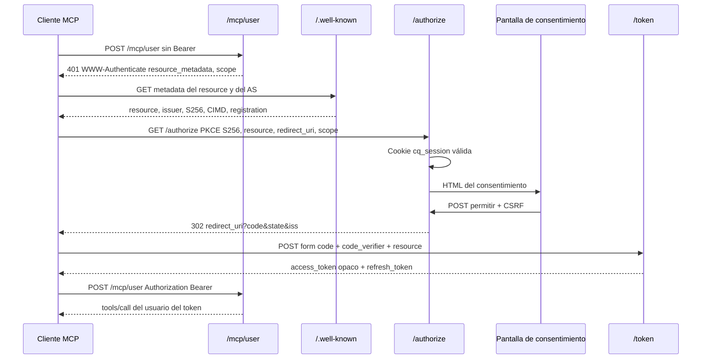

# Spec: MCP autenticado con OAuth

| Campo | Valor |
|---|---|
| Change | `mcp-oauth` |
| Estado | **SPEC ONLY** (sin código) |
| Método | SDD + TDD (strict) |
| Depende de | `specs/mcp-public.spec.md` (Fase 1, en producción) |
| Endpoint nuevo | `POST` y `GET` `/mcp/user` |
| Endpoint público | `/mcp` no se modifica |
| Auth web existente | Cookie `cq_session` (JWT de sesión) + Discord en `GET /api/auth/discord/start` |
| Quién emite los tokens MCP | La librería de abajo. No se firma un JWT a mano |

El usuario conecta Claude, Cursor u otro cliente MCP a **su** catálogo personal: perfil, rutas, progreso y guardado de una ruta generada. El cliente descubre la autorización por los metadatos de la spec, no por un atajo de un producto.

---

## 0. Decisiones cerradas

| Decisión | Valor |
|---|---|
| Resource canónico | `https://codequest-backend-zhydji-2dfcea-31-97-78-167.sslip.io/mcp/user` (sin barra final) |
| Issuer | `https://codequest-backend-zhydji-2dfcea-31-97-78-167.sslip.io` (sin barra final, sin path) |
| Librería AS | `mcp-oauth-server@1.0.0` (npm, 2026-08-11, MIT). Express, montada en el Nest actual |
| Tokens | Opacos, de un solo uso en el refresh, guardados hasheados. **No JWT y no JWKS.** Ver §1 |
| `sub` | `users.id` interno, columna de la fila del access token. Nunca el id de Discord y nunca un argumento de tool |
| Audiencia | Campo `resource` del token = resource canónico (RFC 8707). Otro valor → 401 |
| Login | El mismo Discord. Sin segundo flujo. El token de Discord no se reenvía ni se guarda |
| Transporte del bearer | Solo `Authorization: Bearer`. Query string → 400 `invalid_request` |
| Scopes | `profile:read` `paths:read` `paths:write` `progress:read` `progress:write`. Sin `offline_access` |
| Refresh | Grant `refresh_token`, no es un scope. Rotación en cada uso. Reuso → `invalid_grant` |
| PAT | Bloque §11, opcional y recortable. Fuera del camino feliz |

`/mcp` público sigue stateless, sin header `Authorization`, sin estas rutas y sin estas tablas.

---

## 1. Librería

**Se usa `mcp-oauth-server@1.0.0`.** Es un Authorization Server de OAuth 2.1 pensado para MCP. El SDK oficial de MCP (línea 1.30 que ya usa el backend, y la línea 2) solo deja helpers de Resource Server; el AS hay que traerlo de afuera. Esta librería se monta como router de Express sobre el HTTP que Nest ya tiene. Peer: `express >= 4`, `zod ^4` (el backend ya usa Zod 4).

| RFC / requisito | ¿Lo cubre 1.0.0? |
|---|---|
| PKCE S256 obligatorio (RFC 7636) | Sí. Solo `S256`. Sin `plain` |
| CIMD (`client_id_metadata_document_supported`) | Sí, opt-in. Se enciende |
| DCR (RFC 7591) `POST /register` JSON | Sí. Se deja prendido por clientes sin CIMD |
| Resource Indicators (RFC 8707) | Sí. `strictResource` default `true`. Valida `resource` en authorize y en el token |
| `iss` en el redirect de éxito y de error (RFC 9207) | Sí, si el redirect sale de `authenticateHandler` / el handler de authorize |
| Metadata AS (RFC 8414) | Sí, en `/.well-known/oauth-authorization-server` |
| Metadata de resource (RFC 9728), raíz y con path | Sí |
| `WWW-Authenticate` con `resource_metadata`, `scope`, `insufficient_scope` (RFC 6750) | Sí, `requireBearerAuth` |
| Loopback `http://127.0.0.1` y `http://localhost` con cualquier puerto (RFC 8252 §7.3) | Sí. No hace falta `allowInsecureRedirectUris` |
| Refresh con `consumeRefreshToken` atómico | Sí. El segundo uso no encuentra la fila → `invalid_grant` |
| `token_endpoint` `application/x-www-form-urlencoded` | Sí |
| Registro DCR JSON | Sí |
| Revocación (RFC 7009) `POST /revoke` + `revokeGrant` | Sí |

**Qué no cubre, y no se reimplementa:**

| Hueco | Qué hacemos |
|---|---|
| Access token JWT y JWKS | No existen en la librería. El bearer es opaco. El `sub` y la audiencia salen de la fila, no de claims firmados a mano. No hay clave de firma MCP ni rotación JWKS |
| `private_key_jwt` | CIMD que pida otro método que `none` se rechaza. No se agrega |
| Device flow (RFC 8628) y `client_credentials` | Apagados. `grantTypes` = `authorization_code` y `refresh_token` |
| `offline_access` | No se anuncia. El refresh es el grant, no un scope |
| Consentimiento con la cookie Discord | La librería llama a un UI propio (`authenticateHandler`). La pantalla y el puente de sesión son nuestros; PKCE, códigos y tokens no |

No se usa `oidc-provider` en esta fase: CIMD, el challenge `WWW-Authenticate` de MCP y el loopback con puerto arbitrario ya vienen en `mcp-oauth-server`. Rehacerlos encima de otro AS sería protocolo escrito a mano.

Montaje: `mcpAuthRouter` en la raíz del host, **fuera** del prefijo global `api` (igual que `/mcp`). `issuerUrl` = issuer de §0. `resourceServerUrl` = resource canónico. `allowInsecureRedirectUris: false`. `clientIdMetadataDocuments: true`. `dynamicClientRegistration: true`.

---

## 2. Flujo

Discovery, registro y token no llaman a Discord ni al catálogo. El proceso Nest ya está vivo en Dokploy (servicio Swarm, HEALTHCHECK en `/api/health`). No hay scale-to-zero. Esos tres endpoints deben responder en menos de un segundo con Postgres caliente. El único HTTP saliente es el fetch CIMD, con timeout de 1,5 s y cache (éxito 1 h, fallo 60 s).

### 2.1 Con sesión web



### 2.2 Sin sesión web

1. El cliente abre `/authorize` como arriba.
2. No hay `cq_session` válida. Se guarda la petición de autorización (la librería ya la retiene) y se crea un `resume_id` opaco de un solo uso, TTL 10 minutos, ligado a esa petición.
3. Redirect **302** a `GET /api/auth/discord/start`. No se arma una URL de retorno con el host que mandó el cliente.
4. Discord vuelve a `GET /api/auth/discord/callback` (el mismo de hoy). Se crea o actualiza el usuario, se setea `cq_session`, y **no** se guarda el access token de Discord.
5. El state del login lleva `mcpResumeId`. El callback, si ese campo existe y la fila sigue viva, redirige a `{issuer}/oauth/resume?rid={resume_id}`. Esa URL la arma el servidor. `rid` desconocido, vencido o ya usado → página de error en el front, sin redirect a otro host.
6. `/oauth/resume` vuelve a exigir la cookie y muestra el consentimiento del paso 2.1.
7. `returnTo` del login web sigue siendo un path relativo al front (`sanitizeReturnTo`). Un `returnTo` con `://`, `//` o `\\` no puede saltar al cliente MCP.

El callback de hoy hace `new URL(returnTo, FRONTEND_URL)`. Por eso el resume **no** puede ser un `returnTo` absoluto al issuer. Hay que extender el payload del state (`OAuthStatePayload`) con `mcpResumeId` opcional. Sin ese campo, el callback sigue yendo al front. No es un segundo login.

---

## 3. Datos

Migración TypeORM nueva, después de `1758412800000-InitAuthLearningPaths`. Sin `synchronize`. Tokens y códigos se guardan como SHA-256 del valor entregado al cliente. La tabla no tiene el bearer en claro.

| Tabla | Para qué | Columnas que importan |
|---|---|---|
| `oauth_clients` | DCR | `client_id` PK, `client_name`, `redirect_uris` text[], `token_endpoint_auth_method` (`none` o `client_secret_post`), `client_secret_hash` nullable, `grant_types`, `scope`, `created_at` |
| `oauth_cimd_documents` | Cache CIMD | `client_id` (la URL) PK, `document` jsonb, `fetched_at`, `expires_at` |
| `oauth_authorization_codes` | Canje único | `code_hash` PK, `client_id`, `user_id` FK `users`, `redirect_uri`, `code_challenge`, `scopes` text[], `resource`, `grant_id` uuid, `expires_at` |
| `oauth_access_tokens` | Bearer opaco | `token_hash` PK, `user_id` FK, `client_id`, `scopes` text[], `resource`, `grant_id`, `expires_at`, `revoked_at` |
| `oauth_refresh_tokens` | Rotación | `token_hash` PK, `client_id`, `user_id`, `grant_id`, `scopes`, `resource`, `expires_at`, `consumed_at` |
| `oauth_resume` | Puente Discord → `/authorize` | `id` uuid PK, `authorization_request` jsonb, `csrf_secret_hash`, `expires_at`, `used_at` |

`consumeAuthorizationCode` y `consumeRefreshToken` son un `DELETE ... WHERE token_hash = $1 AND client_id = $2 RETURNING *` en la misma sentencia. Cero filas → la librería responde `invalid_grant`. No hay códigos `reuse_detected` ni similares.

`revokeGrant(grant_id)` borra access y refresh de ese grant. La pantalla "aplicaciones conectadas" llama eso.

CIMD no inserta fila en `oauth_clients`. El documento se cachea. `client_id` del JSON tiene que ser igual a la URL pedida. Documentos que no sean HTTPS, con userinfo, con loopback o de más de 10 KB se rechazan (lo hace la librería).

PAT, si se implementa, va en su propia tabla. No comparte filas con `oauth_access_tokens`. §11.

El `user_id` de estas tablas es el uuid de `users`. El progreso ya es `user_course_progress (user_id, course_id)` y las rutas ya son `learning_paths.user_id`. No se duplican esas tablas.

---

## 4. Metadata exacta

Los dos GET de resource devuelven el mismo JSON:

- `GET /.well-known/oauth-protected-resource`
- `GET /.well-known/oauth-protected-resource/mcp/user`

```json
{
  "resource": "https://codequest-backend-zhydji-2dfcea-31-97-78-167.sslip.io/mcp/user",
  "authorization_servers": [
    "https://codequest-backend-zhydji-2dfcea-31-97-78-167.sslip.io"
  ],
  "scopes_supported": [
    "profile:read",
    "paths:read",
    "paths:write",
    "progress:read",
    "progress:write"
  ],
  "bearer_methods_supported": ["header"],
  "resource_name": "CodeQuest"
}
```

`authorization_servers` tiene un solo elemento, el issuer. `resource` no lleva barra final y es la URL a la que el cliente hace POST.

`GET /.well-known/oauth-authorization-server`:

```json
{
  "issuer": "https://codequest-backend-zhydji-2dfcea-31-97-78-167.sslip.io",
  "authorization_endpoint": "https://codequest-backend-zhydji-2dfcea-31-97-78-167.sslip.io/authorize",
  "token_endpoint": "https://codequest-backend-zhydji-2dfcea-31-97-78-167.sslip.io/token",
  "registration_endpoint": "https://codequest-backend-zhydji-2dfcea-31-97-78-167.sslip.io/register",
  "revocation_endpoint": "https://codequest-backend-zhydji-2dfcea-31-97-78-167.sslip.io/revoke",
  "response_types_supported": ["code"],
  "grant_types_supported": ["authorization_code", "refresh_token"],
  "code_challenge_methods_supported": ["S256"],
  "token_endpoint_auth_methods_supported": ["none", "client_secret_post"],
  "revocation_endpoint_auth_methods_supported": ["none"],
  "client_id_metadata_document_supported": true,
  "authorization_response_iss_parameter_supported": true,
  "scopes_supported": [
    "profile:read",
    "paths:read",
    "paths:write",
    "progress:read",
    "progress:write"
  ]
}
```

Esos well-known, más `/authorize`, `/token`, `/register`, `/revoke` y `/oauth/resume`, se excluyen del prefijo `api`. `POST /token` exige `application/x-www-form-urlencoded`. `POST /register` exige JSON.

---

## 5. Challenges HTTP

`/mcp/user` sin token, con token vencido, con firma que no aplica (token opaco desconocido), con `resource` distinto, o revocado:

HTTP **401**. Cuerpo JSON-RPC de error, nunca 200 y nunca `isError` de tool.

```http
WWW-Authenticate: Bearer resource_metadata="https://codequest-backend-zhydji-2dfcea-31-97-78-167.sslip.io/.well-known/oauth-protected-resource/mcp/user", scope="profile:read paths:read paths:write progress:read progress:write"
```

Scope de menos para la tool concreta: HTTP **403**.

```http
WWW-Authenticate: Bearer error="insufficient_scope", scope="paths:write", resource_metadata="https://codequest-backend-zhydji-2dfcea-31-97-78-167.sslip.io/.well-known/oauth-protected-resource/mcp/user"
```

`scope` en el 403 lista solo los scopes que faltan para esa tool. `access_token` en la query: HTTP 400, `error=invalid_request`, sin canjear el valor.

El verificador es el de la librería (`requireBearerAuth` / `verifyAccessToken`) con `resource` = resource canónico. Después, el wrapper de cada tool mira `scopes` de la fila. El `userId` inyectado al servicio es `oauth_access_tokens.user_id`. Un campo `user_id` en el input de la tool no existe en el schema; si el cliente lo manda igual, el handler no lo lee.

---

## 6. Tools de `/mcp/user`

Mismo transporte que Fase 1: `McpServer` + `StreamableHTTPServerTransport({ sessionIdGenerator: undefined })` por request. Las cinco tools públicas se registran con `registerMcpTools` del módulo `mcp-public`, sin copiar el generador. Esas cinco no piden scope de usuario: alcanza un bearer válido de este resource. El catálogo sigue saliendo de `CatalogRepository.getCurrent()`.

Las tools nuevas delegan en servicios que ya existen. No hay un segundo motor de rutas.

| Tool | Scope | Servicio |
|---|---|---|
| `search_courses`, `get_course`, `list_official_paths`, `get_official_path`, `generate_learning_path` | solo bearer | los de Fase 1 |
| `get_my_profile` | `profile:read` | `AuthService.getMe` + conteos |
| `list_my_paths` | `paths:read` | `LearningPathsService.list` |
| `get_my_path` | `paths:read` y `progress:read` | `LearningPathsService.getById` + `renderMermaid` |
| `save_learning_path` | `paths:write` | método nuevo `saveGenerated` en `LearningPathsService` |
| `update_course_progress` | `progress:write` | `findByIdForUser` + `ProgressService.upsert` |

`get_my_path` sin uno de los dos scopes → 403 con el scope que falta. Ruta de otro usuario, o id que no existe → resultado de tool `isError` con texto `not_found` (HTTP 200, porque el bearer sí era válido). Igual que `get_official_path` en el server público.

### 6.1 `get_my_profile`

Nombre visible, avatar, cantidad de rutas `active`, cantidad de filas `user_course_progress` en `completed` de ese usuario. Sin email, sin id de Discord, sin id interno en la salida.

```ts
{
  display_name: string
  avatar_url: string | null
  active_path_count: number
  completed_course_count: number
}
```

### 6.2 `list_my_paths`

Input: `status` opcional `active` | `archived` | `all`, default `active` (el mismo criterio que `ListLearningPathsQueryDto`).

Cada item es el resumen que ya arma `toSummary`: `id`, `title`, `kind`, `status`, `item_count`, `completed_count`, `progress_ratio`, `updated_at`. `progress_ratio` = completados / items, o 0 si no hay items.

### 6.3 `get_my_path`

Input: `id` uuid de la ruta. Solo si `findByIdForUser` devuelve fila.

Items en orden de `position`, con el progreso que ya calcula `toItemDto` (`not_started` si no hay fila). El diagrama reutiliza el escape de Fase 1 y agrega el estado al class del nodo: `required`, `recommended`, `optional`, `anytime` o `search` (si `bucket` es null) más `NotStarted` | `InProgress` | `Completed`. Ejemplo: `:::requiredCompleted`. Las flechas siguen el orden de `position` de los items guardados, `inferred: true`. El Mermaid de `/mcp` público no cambia.

### 6.4 `save_learning_path`

Guarda la salida de `generate_learning_path` como ruta del usuario. Input:

| Campo | Regla |
|---|---|
| `course_ids` | string[], 1–50, sin duplicados |
| `title` | opcional, 1–200. Si falta, `"Ruta generada"` |
| `buckets` | opcional, mismo largo que `course_ids`, cada uno `required` \| `recommended` \| `optional` \| `anytime`. Si no viene o no calza, el bucket guardado es null |
| `source_path_id` | opcional. Si viene, tiene que existir en el snapshot; se guarda en `sourceCatalogPathId`. Si no, null |

`saveGenerated` vive en `LearningPathsService` y reusa `requireCatalogForWrite`, `findCourse` y `assertNoDuplicateCourseIds`. Para cada id:

- el curso tiene que estar en el snapshot con `status === "ok"`;
- si no, error de tool `invalid_input` y no se crea la ruta;
- `courseTitle` y `courseSlug` salen del curso del catálogo. El título que mande el cliente se ignora.

`kind` = `generated`. `catalogVersion` = el del snapshot. `create()` actual no se usa para esto: un kind distinto de `custom` hoy entra por `createOfficial` y exigiría `catalogPathId`.

### 6.5 `update_course_progress`

Input: `path_id` uuid, `course_id` string decimal, `status` `not_started` | `in_progress` | `completed`.

1. `findByIdForUser(path_id, userId)`. Si no hay fila → `not_found`.
2. El `course_id` tiene que ser un item de esa ruta. Si no → `not_found`.
3. `ProgressService.upsert(userId, courseId, status)`.

El progreso sigue siendo uno por usuario y curso, como `PUT /api/me/courses/:courseId/progress`. Si el mismo curso está en dos rutas **de ese usuario**, las dos ven el mismo estado. No se puede escribir el progreso de la ruta de otra persona: el paso 1 no la encuentra.

---

## 7. Consentimiento, CSRF y revocación

La pantalla la sirve el backend en la respuesta de `/authorize` cuando ya hay sesión. Muestra:

- `client_name` del CIMD o del DCR;
- el **hostname** del `redirect_uri` (no la URI entera como único dato);
- cada scope en español: perfil, ver rutas, guardar rutas, ver progreso, actualizar progreso;
- si todos los `redirect_uris` del cliente son loopback, el texto: el código puede volver a un programa en esta máquina.

Botones Permitir y Rechazar. El POST lleva un CSRF de un solo uso guardado hasheado en `oauth_resume` y atado a la cookie de sesión. CSRF ausente o de otra sesión → 403, sin redirect al cliente. Rechazar → redirect al `redirect_uri` con `error=access_denied` e `iss={issuer}`. Permitir → `authenticateHandler`, que agrega `iss` también en el éxito.

Aplicaciones conectadas (cookie web, no el bearer MCP):

- `GET /api/me/connected-apps` lista grant, nombre, hostname, scopes, fecha. Sin tokens.
- `DELETE /api/me/connected-apps/:grantId` solo si el grant es del usuario de la cookie. Llama `revokeGrant`. Los refresh de ese grant dejan de canjearse.

Open redirect: el resume del §2.2 es el único puente nuevo. El id no es una URL. El callback no concatena input del cliente al host de destino.

---

## 8. Entorno

No hay clave de firma para el access token MCP. Rotar `SESSION_JWT_SECRET` invalida `cq_session` y no invalida bearers MCP (viven en Postgres). Revocar MCP es borrar o marcar filas.

| Variable | Valor |
|---|---|
| `MCP_ISSUER_URL` | issuer de §0, sin barra final |
| `MCP_RESOURCE_URL` | resource de §0, sin barra final |
| `MCP_ACCESS_TOKEN_TTL_SECONDS` | `900` |
| `MCP_REFRESH_TOKEN_TTL_SECONDS` | `1209600` (14 días). Cada uso emite otro y consume el anterior |
| `MCP_CIMD_FETCH_TIMEOUT_MS` | `1500` |

En producción las dos URL son obligatorias y tienen que ser `https`. No se leen de `FRONTEND_URL`. El ejemplo de Dokploy es el de la tabla de §0.

Latencia: el contenedor no se apaga entre requests. Metadata sale de esas env vars en memoria. `/token` y `/register` tocan solo Postgres. El timeout CIMD evita que un cliente lento estire el `/authorize` hacia los 10 s.

---

## 9. Plan de tests

Sin Discord real: el callback de identidad se prueba con el doble que ya usan los tests de auth. Cliente de test: PKCE S256 de verdad (verifier aleatorio, challenge SHA-256), redirect loopback.

| Caso | Resultado |
|---|---|
| Sin bearer y con bearer basura en `POST /mcp/user` | 401 y el `WWW-Authenticate` de §5. El body no es un resultado de tool |
| `resource` del token distinto del canónico | 401 |
| Access vencido o hash desconocido | 401 |
| Tool con scope de menos | 403 `error="insufficient_scope"` y el scope que falta |
| Authorize sin `code_challenge` o con `plain` | redirect de error con `iss` |
| Redirect que no está en el CIMD o en el DCR | error, sin código |
| Loopback registrado en el puerto 8787 y usado en el 49152 | el código sale. `https://claude.ai/api/mcp/auth_callback` solo si el documento del cliente lo declara |
| Canje del code, segundo canje del mismo code | el segundo es `invalid_grant` |
| Refresh, y reuso del refresh ya rotado | el segundo es `invalid_grant` |
| Usuario A no lee ni actualiza la ruta de B | `not_found` en la tool |
| `save_learning_path` con un `course_id` que no está en el catálogo `ok` | no hay fila nueva. El título lo pone el catálogo |
| CSRF del consentimiento inválido | 403, el cliente no recibe `code` |
| `returnTo=https://evil.example` y `rid` inventado | el navegador no sale hacia ese host |
| `?access_token=` | 400 |
| Las cinco tools públicas en `/mcp/user` con bearer | misma salida que `/mcp` para el mismo catálogo |
| `/mcp` sin bearer | igual que Fase 1. Esta fase no le exige auth |

Los asserts de 401/403 no aceptan stack, host de Postgres ni el body de Discord.

---

## 10. README (cuando se implemente)

URL del connector: `https://codequest-backend-zhydji-2dfcea-31-97-78-167.sslip.io/mcp/user`

Claude.ai: Ajustes → Conectores → conector personalizado. Esa URL. Sin API key. El cliente sigue el metadata y abre el login de Discord en el navegador.

Claude Code:

```bash
claude mcp add --transport http codequest-user https://codequest-backend-zhydji-2dfcea-31-97-78-167.sslip.io/mcp/user
```

Cursor, `.cursor/mcp.json`, solo `url`:

```json
{
  "mcpServers": {
    "codequest-user": {
      "url": "https://codequest-backend-zhydji-2dfcea-31-97-78-167.sslip.io/mcp/user"
    }
  }
}
```

`/mcp` público se documenta aparte y sigue sin login. El PAT, si entra, se documenta solo en el párrafo de §11.

---

## 11. Opcional — Personal Access Token

Recortable. No hace falta para Claude.ai, que no deja poner un header fijo. Sirve en Cursor y Claude Code cuando el cliente puede mandar `Authorization`.

- El usuario lo crea en la web, con la cookie, eligiendo un subconjunto de los cinco scopes.
- Se muestra una vez, prefijo `cqp_`. En la base queda el SHA-256.
- `DELETE` lo revoca.
- El mismo verificador de `/mcp/user`: si el bearer empieza con `cqp_`, busca el hash, el usuario y los scopes; si no, sigue por el access token de la librería. Audiencia no aplica al PAT: el PAT solo se acepta en este resource.
- Vencimiento opcional. Revocado o vencido → el mismo 401 de §5.
- No entra a `scopes_supported`, no sustituye a OAuth y no se manda en la query.

---

## 12. Dudas / supuestos

1. **El access token no es JWT.** La decisión "JWT con `aud`" choca con "no emitir tokens a mano". Gana la librería: audiencia = columna `resource`. Si más adelante hace falta un JWT verificable sin Postgres, es otro spec.
2. **Refresh sin `offline_access`.** Los clientes que exijan ese scope en el metadata no van a pedir refresh por scope. El grant `refresh_token` igual rota. Si un cliente real se niega a guardar refresh sin ver el scope, se agrega el scope en un cambio de spec, no en silencio.
3. **`client_secret_post` está anunciado** porque la librería lo implementa para DCR confidencial. Los clientes MCP públicos usan `none`. CIMD que pida secret se rechaza.
4. **Progreso compartido entre rutas del mismo usuario** es el modelo de `user_course_progress`, no un bug de esta fase.
5. **`saveGenerated` es un método nuevo** en el servicio de rutas. `create()` no aprende el kind `generated` en esta fase, para no mezclarlo con el kind `official`.
6. **El hostname del issuer** está fijado al sslip.io actual. Si el dominio cambia, cambian `MCP_ISSUER_URL` y `MCP_RESOURCE_URL` juntas. Los tokens viejos quedan con el `resource` anterior y el resource server los rechaza.
7. **SameSite de `cq_session`.** El consentimiento y el callback viven en el host del API. Con `Lax`, una navegación de nivel superior hasta `/authorize` manda la cookie. No hace falta un fetch cross-origin con credenciales.
8. **La pantalla de aplicaciones conectadas** es HTML del front contra `/api/me/connected-apps`. No es una tool MCP.
