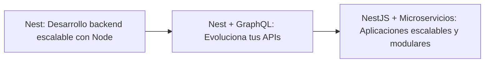

# Spec: MCP server público de solo lectura

| Campo | Valor |
|---|---|
| Change | `mcp-public` |
| Estado | **SPEC ONLY** (sin código) |
| Método | SDD + TDD (strict) |
| Transporte | Streamable HTTP, modo stateless |
| Auth | Ninguna en `/mcp` |
| Catálogo | Redis `catalog:current` + cache de proceso; seed si Redis no responde |
| Snapshot inspeccionado | Redis `catalog:v1`, `source: scraper`, `generatedAt: 2026-09-21T02:11:10.650Z`, 80 cursos, 13 rutas. El archivo `catalog.seed.json` del repo **no** sirve como evidencia de rutas (1 curso, 0 paths). |

> Este documento es el contrato. La implementación MUST seguirlo. Fase 2 (auth y datos de usuario) queda fuera.

---

## 0. Decisiones cerradas

| Decisión | Valor |
|---|---|
| Endpoint | `POST` y `GET` `/mcp` (sin prefijo `/api`) |
| Sesiones MCP | No. `sessionIdGenerator: undefined` |
| SDK | `@modelcontextprotocol/sdk@1.30.1` (`latest` en npm, línea **estable**). No usar `@modelcontextprotocol/node` `2.0.0-alpha.*` |
| Quién elige cursos | El servidor. El LLM cliente solo llama tools |
| Motor | Puerto `LearningPathGenerator`. v1 = alias → ruta oficial, si no hay match → búsqueda textual |
| Auth / scraper / Postgres de catálogo | No se tocan |

El SDK oficial de TypeScript **sí** permite stateless. `StreamableHTTPServerTransport` con `sessionIdGenerator: undefined` no emite ni exige `Mcp-Session-Id` y no guarda sesión. No hace falta store. Cada request crea un `McpServer` nuevo, lo conecta al transport y lo cierra al terminar. El modo stateful queda prohibido en esta fase.

`GET /mcp` lo atiende el mismo transport. En stateless el SDK no abre un stream SSE de notificaciones servidor→cliente: responde **405** si el cliente pide un stream sin sesión. Eso es el comportamiento del SDK, no un segundo transporte. Los clientes que solo usan `POST` (Claude.ai, Claude Code, Cursor) no dependen de ese GET. No implementar el SSE legacy (`/sse` + `/messages`).

---

## 1. Arquitectura

El backend es NestJS 11. El módulo nuevo vive en `backend/src/modules/mcp-public/` y se importa desde `AppModule`.

```
mcp-public/
  mcp-public.module.ts          # registra el controller; no importa Identity
  mcp-http.controller.ts        # POST/GET /mcp, excluido del prefijo global `api`
  catalog-cache.ts              # cache de proceso invalidado por catalog:current
  path-aliases.json             # mapa de alias versionado en el repo
  learning-path-generator.ts    # puerto + implementación v1
  tools/                        # registro de las 5 tools sobre McpServer
  mermaid.ts                    # escape + flowchart
```

Montaje:

- El controller declara `@Controller()` sin segmento `api`. `main.ts` MUST excluir la ruta `mcp` del `setGlobalPrefix('api')` (opción `exclude`). La URL pública es `{ORIGIN}/mcp`, no `/api/mcp`.
- El handler Nest lee el `Request` de Express y lo adapta a `StreamableHTTPServerTransport.handleRequest`. No reimplementar JSON-RPC.
- Imports del SDK (1.30.1):

```ts
import { McpServer } from '@modelcontextprotocol/sdk/server/mcp.js'
import { StreamableHTTPServerTransport } from '@modelcontextprotocol/sdk/server/streamableHttp.js'
```

- Cada request: `new McpServer(...)` → `new StreamableHTTPServerTransport({ sessionIdGenerator: undefined })` → `server.connect(transport)` → `transport.handleRequest(...)`.
- El generador y las tools dependen del puerto de catálogo ya existente (`CatalogRepository.getCurrent()` / token `CATALOG_REPOSITORY`). Si `getCurrent()` lanza o devuelve `null` y el seed local tampoco carga, las tools fallan con el error MCP de §5, nunca con un snapshot inventado.
- `IdentityModule` no se importa. El controller no lee cookies ni `cq_session`.

Lectura de catálogo:

1. Leer la clave `catalog:current` (valor `vN`).
2. Si la versión cacheada en el proceso es distinta, leer `catalog:vN` y reemplazar el snapshot en memoria.
3. Si Redis no responde o no hay puntero: leer `backend/src/modules/catalog-scraper/data/catalog.seed.json` una vez y cachearlo como versión de respaldo. Hoy ese seed tiene `paths: []`; las tools de rutas oficiales devuelven lista vacía y `generate_learning_path` cae al fallback de búsqueda (también vacío si el seed no trae cursos útiles). No se rellena el seed en esta fase.
4. No hay tabla Postgres de catálogo. No hay segundo cliente Redis.

---

## 2. Evidencia del snapshot (Redis `catalog:v1`)

Inspección de 2026-09-25 contra el Redis de Dokploy. 13 rutas, las de `OFFICIAL_PATH_IDS`.

Campos reales de cada entrada (`PathEntry` + `courseId`): `bucket`, `courseSlug`, `courseUrl`, `label`, `tags`, `position`, `courseId`.

| Hecho | Valor |
|---|---|
| Aristas / prerequisitos entre cursos | **No existen.** Cero claves de grafo en la ruta ni en la entrada |
| `position` | Entero global, contiguo `0 .. n-1`, en el orden del DOM de la página. No es un orden que reinicie dentro del bucket |
| Buckets | `REQUIRED` \| `RECOMMENDED` \| `OPTIONAL` \| `ANYTIME`. Los buckets se intercalan: en `programas-react` REQUIRED es solo la posición 1 |
| `tags` | Badges de pista (`bases`, `frontend`, `backend`, `móvil`). No son el stack |
| `courseId` | `number` o `null` si el slug no resolvió a un curso publicado. Hay entradas sin resolver (p. ej. 1 en fundamentos, 2 en Java) |
| `learningPathUrl` / `relatedCourses` | Del **curso**, no de la ruta. No son aristas de la ruta oficial |

Ejemplo real, REQUIRED de `programas-nest`, ya ordenado por `position`:

| position | courseId | slug | label |
|---|---|---|---|
| 3 | 2063649 | `nest` | Nest: Desarrollo backend escalable con Node |
| 6 | 2095680 | `nest-graphql` | Nest + GraphQL: Evoluciona tus APIs |
| 9 | 2896449 | `nestjs-microservicios` | NestJS + Microservicios: Aplicaciones escalables y modulares |

**Limitación de `edges` (obligatoria):** al no haber conexiones scrapeadas, `edges` es la secuencia lineal de los cursos `required` ordenados por `position`. Campo `inferred: true` y `kind: "linear_required"`. No implica prerequisito pedagógico más allá del orden de la página. No se modifica el scraper en esta fase.

---

## 3. Contrato de las tools

Todas:

- `annotations.readOnlyHint: true`
- `annotations.openWorldHint: false`
- Resultado MCP: `content: [{ type: "text", text: <JSON string> }]` más `structuredContent` con el objeto de salida (el SDK 1.30 lo soporta). El JSON de texto es la fuente que el cliente debe poder parsear aunque ignore `structuredContent`.
- IDs de curso en la salida son **string decimal** del id numérico del catálogo (`"2063649"`), para no perder precisión. La entrada acepta ese string o un número entero JSON; se normaliza a string decimal. Un id que no esté en el snapshot se ignora (no se inventa el curso).
- URLs de curso: `courseUrl` de la entrada de ruta, o `https://cursos.devtalles.com/courses/{slug}` si se arma desde el curso.
- Preview de YouTube: si `previewYoutubeId` es null, `previewUrl` es null. Si no, `https://www.youtube.com/watch?v={id}`.
- Precio: `{ amount: number, currency: "USD" }`. Gratis = `amount === 0`.
- Buckets en la API MCP van en minúsculas: `required` | `recommended` | `optional` | `anytime`.

Errores de tool (JSON-RPC tool error, `isError: true`), mensaje estable, sin stack:

| Código | Cuándo |
|---|---|
| `catalog_unavailable` | Ni Redis ni seed pudieron cargarse |
| `invalid_input` | El input no cumple el schema. El SDK responde con su texto de validación (`Input validation error: ...`), no con el código literal `invalid_input`. Aceptado. |
| `not_found` | `get_course` o `get_official_path` con id inexistente en el snapshot actual |
| `payload_too_large` | Body HTTP por encima del límite de §6 |

### 3.1 `search_courses`

**Descripción (para el LLM):** Busca cursos que existen ahora en el catálogo DevTalles. Usala cuando el usuario nombre un tema, quiera filtrar por gratis/pago o por una ruta oficial, o necesite candidatos. No genera una ruta ordenada; para eso usá `generate_learning_path`. Nunca inventa cursos.

**Input**

| Campo | Tipo | Obligatorio | Límite |
|---|---|---|---|
| `query` | string | sí | 1–200 caracteres tras trim |
| `official_path_id` | string | no | debe ser un id de `OFFICIAL_PATH_IDS`; si no está en el snapshot, `not_found` |
| `price` | `"free"` \| `"paid"` \| `"any"` | no | default `any` |
| `limit` | integer | no | default 10, mínimo 1, **máximo 25** |

**Output**

```ts
{
  catalog_version: number
  courses: Array<{
    id: string
    slug: string
    title: string
    short_description: string | null   // metaDescription, recortada a 280 caracteres
    price: { amount: number, currency: "USD" }
    lesson_count: number | null
    video_hours: number | null
    instructor: string | null
    url: string
    official_path_ids: string[]        // rutas del snapshot donde el courseId aparece
  }>
}
```

Orden: el de §4.4. Cursos con `status !== "ok"` se excluyen, incluidos los `partial`.

### 3.2 `get_course`

**Descripción:** Detalle de un curso que ya está en el catálogo, por id. Usala después de una búsqueda o de una ruta, cuando haga falta el temario, los requisitos o el video. Si el id no está en el catálogo actual, error `not_found`.

**Input:** `id` string obligatorio (o número entero). Sin otros campos.

**Output**

```ts
{
  catalog_version: number
  course: {
    id: string
    slug: string
    title: string
    description: string | null
    prerequisites: string[]             // texto, tal cual el snapshot
    preview_url: string | null
    sections: Array<{
      index: number
      title: string
      lessons: Array<{ index: number, title: string, is_free_preview: boolean }>
    }>
    related_courses: Array<{ id: string | null, slug: string, title: string, url: string }>
    price: { amount: number, currency: "USD" }
    lesson_count: number | null
    video_hours: number | null
    instructor: string | null
    url: string
  }
}
```

`related_courses[].id` es null si el slug relacionado no está en el snapshot. No se completa con datos externos.

### 3.3 `list_official_paths`

**Descripción:** Lista las rutas oficiales de DevTalles que hay en el catálogo actual (React, Nest, Dart, etc.). Usala para mostrar el menú de rutas antes de armar una. No arma la ruta del usuario.

**Input:** objeto vacío.

**Output**

```ts
{
  catalog_version: number
  paths: Array<{ id: string, title: string, course_count: number }>
}
```

`course_count` cuenta solo entradas con `courseId` no null. Orden: el de `OFFICIAL_PATH_IDS`. Una ruta del enum que no esté en el snapshot se omite.

### 3.4 `get_official_path`

**Descripción:** Devuelve una ruta oficial completa: cursos en el orden del sitio, bucket y un diagrama Mermaid. Usala cuando ya se conoce el id de la ruta. Las flechas del diagrama son el orden lineal de los cursos obligatorios, no un grafo scrapeado.

**Input:** `id` string obligatorio.

**Output**

```ts
{
  catalog_version: number
  path: {
    id: string
    title: string
    url: string                         // https://cursos.devtalles.com/pages/{id}
    courses: Array<{
      course_id: string | null          // null solo si se documenta el hueco; ver abajo
      title: string                     // label de la entrada
      url: string
      bucket: "required" | "recommended" | "optional" | "anytime"
      position: number
      partial: boolean
    }>
    edges: Array<{ from_course_id: string, to_course_id: string }>
    edges_meta: { kind: "linear_required", inferred: true }
    diagram: { mermaid: string }
  }
}
```

Se **omiten** entradas con `courseId` null (no hay curso real que devolver). El orden de `courses` es `position` ascendente. `edges` une, en ese orden, solo los que tienen bucket `required`. Si hay 0 o 1 required, `edges` es `[]`.

### 3.5 `generate_learning_path`

**Descripción:** Arma una ruta de estudio para una meta o tecnología usando solo cursos del catálogo actual. Usala cuando el usuario diga qué quiere aprender. No uses `search_courses` para inventar el orden: esta tool ya elige la ruta oficial o, si no hay, un ranking textual determinista.

**Input**

| Campo | Tipo | Obligatorio | Límite |
|---|---|---|---|
| `goal` | string | sí | 1–200 caracteres tras trim |
| `known_course_ids` | string[] | no | default `[]`, máximo 50 ids |
| `include_optional` | boolean | no | default `false` |

**Output**

```ts
{
  strategy: "official_path" | "catalog_search"
  source_path_id: string | null
  items: Array<{
    course_id: string
    title: string
    url: string
    bucket: "required" | "recommended" | "optional" | "anytime" | null
    position: number
    already_known: boolean
    partial: boolean
  }>
  edges: Array<{ from_course_id: string, to_course_id: string }>
  edges_meta: { kind: "linear_required" | "linear_ranked", inferred: true }
  diagram: { mermaid: string }
  catalog_version: number
  notes: string
}
```

`bucket` es `null` solo en `catalog_search` (no hay bucket oficial). `position` en ese modo es el índice 0..n-1 del ranking.

---

## 4. Algoritmo v1

### 4.1 Normalización

Aplicar en alias, `goal` y textos de curso, en este orden:

1. `String.prototype.normalize("NFD")` y borrar marcas combinantes (`\p{M}`).
2. Minúsculas con `toLocaleLowerCase("es")`. `toLowerCase("es")` no existe en Node. Aceptado.
3. Reemplazar `&` y `+` por espacio.
4. Borrar todo carácter que no sea letra, número o espacio.
5. Colapsar espacios y trim.

`"React.js"` y `"réact"` pasan a `"react"`. `"C#"` pasa a `"c"`. Por eso el alias de C# es la lista `["c", "csharp", "dotnet"]`, no el símbolo `#`.

### 4.2 Alias → ruta oficial

Archivo `path-aliases.json`:

```json
{
  "version": 1,
  "entries": [
    { "path_id": "programas-fundamentos", "aliases": ["fundamentos", "javascript", "js"] },
    { "path_id": "programas-react", "aliases": ["react", "reactjs"] },
    { "path_id": "programas-vue", "aliases": ["vue", "vuejs"] },
    { "path_id": "programas-angular", "aliases": ["angular"] },
    { "path_id": "programas-node", "aliases": ["node", "nodejs"] },
    { "path_id": "programas-nest", "aliases": ["nest", "nestjs"] },
    { "path_id": "ruta-dart", "aliases": ["dart", "flutter", "movil"] },
    { "path_id": "ruta-python", "aliases": ["python"] },
    { "path_id": "ruta-java", "aliases": ["java"] },
    { "path_id": "ruta-c", "aliases": ["csharp", "dotnet", "c"] },
    { "path_id": "ruta-ia", "aliases": ["ia", "inteligencia artificial", "llm"] },
    { "path_id": "ruta-php", "aliases": ["php"] },
    { "path_id": "ruta-go", "aliases": ["go", "golang"] }
  ]
}
```

Match, sobre el `goal` ya normalizado (`G`):

1. Un alias normalizado `A` matchea si `A` es una frase completa: `G === A`, o `G` contiene `A` entre límites de palabra (`(^| )A($| )`).
2. Entre los alias que matchean, gana el de **mayor longitud de `A`**. Empate: menor `path_id` en orden lexicográfico.
3. El `path_id` ganador debe existir en el snapshot. Si el alias apunta a una ruta ausente, se descarta y se sigue con el siguiente.
4. Si no queda ninguno: estrategia `catalog_search`.

Ejemplos: `"React"` → `programas-react`. `"backend con Node"` → `programas-node` (el alias `node` está como palabra). `"nestjs microservicios"` → `programas-nest` (`nestjs` es más largo que no hay otro alias). `"quiero aprender"` sin alias → `catalog_search`.

### 4.3 Items de una ruta oficial

Dado el path y `include_optional`:

- Siempre entran buckets `required` y `recommended`.
- Si `include_optional` es true, también `optional` y `anytime`.
- Se omiten entradas con `courseId` null o cuyo curso no está en el snapshot.
- Un curso `status === "partial"` se incluye, con `partial: true`. Un curso `ok` sale con `partial: false`. `search_courses` y `get_course` siguen excluyendo `partial`.
- Orden: `position` ascendente. El `position` de salida es el del snapshot, no se reenumera.
- `already_known` es true si el id está en `known_course_ids` (ids desconocidos en el catálogo se ignoran, no son error).
- `title` es `label` de la entrada. `url` es `courseUrl`.

`notes` es una plantilla fija, no un texto de LLM:

```
Ruta oficial {title} ({path_id}) elegida porque "{alias}" aparece en la meta. Catálogo v{version}. {omitted} curso(s) de la página no están publicados y se omitieron. Las flechas siguen el orden de los cursos obligatorios en la página, no un grafo de prerequisitos.
```

`{alias}` es el alias ganador. `{omitted}` es el conteo de `courseId` null en los buckets incluidos.

### 4.4 Fallback de relevancia (`catalog_search`)

Tokens = palabras del `goal` normalizado, sin vacías. Si no hay tokens, `items: []`, `notes` lo dice, sin error.

Para cada curso `ok` del snapshot, puntaje entero (solo suma, no hay TF-IDF):

| Señal | Puntos por token |
|---|---|
| El token es una palabra del título normalizado | 10 |
| El token aparece en el slug (guiones tratados como espacios) | 6 |
| El token es palabra de `metaDescription` normalizada | 3 |
| El token es palabra de `description` normalizada (si no sumó ya por la meta) | 1 |

Además, una sola vez: si `G` es substring del título normalizado, +25.

Un curso con puntaje 0 se descarta. Orden: puntaje descendente, luego `id` ascendente. `limit` efectivo: 10 fijo en el generador (no es el `limit` de `search_courses`). `position` = índice en ese orden. `bucket` null. `edges_meta.kind = "linear_ranked"`: flecha del item `i` al `i+1` en ese ranking (todos los items, no solo required, porque no hay required).

`search_courses` usa el mismo puntaje, con los filtros `price` y `official_path_id` aplicados **antes** de puntuar, y el `limit` del input (tope 25). Mismo desempate por `id`.

`notes` del fallback:

```
No hay alias de ruta oficial para "{goal_normalizado}". Se listan los {n} cursos del catálogo v{version} con mayor puntaje textual. El orden es ese ranking, no una ruta oficial.
```

### 4.5 Determinismo

Prohibido: `Math.random`, reloj, orden de iteración de `Map` no ordenado, locale distinto del algoritmo de §4.1. Misma `goal` + mismos `known_course_ids` (como conjunto; se ordenan para el flag, no cambian el orden de items) + mismo `include_optional` + mismo snapshot = mismos bytes de salida salvo el orden de claves JSON, que MUST ser el de los schemas de §3.

---

## 5. Mermaid

`diagram.mermaid` es un `flowchart LR`. Un nodo por item incluido. Id de nodo: `c` + `course_id` (solo dígitos). La etiqueta va entre comillas dobles.

Escape de la etiqueta, en orden:

1. Borrar `\r` y `\n`.
2. `\` → `\\`.
3. `"` → `\"`.

No se usa el título como id. Así `"`, `+` y `:` en títulos reales no rompen el diagrama. Cada nodo lleva clase visual `:::bucket` y, si aplica, `Known` o `Partial` (`requiredPartial` para un obligatorio a medias), más las líneas `classDef`. Aceptado: el ejemplo de abajo muestra la cadena de flechas; la salida real agrega esas clases.

Ejemplo real a partir de los tres REQUIRED de `programas-nest` en `catalog:v1` (flechas inferidas):



Ese es el `diagram.mermaid` de `get_official_path("programas-nest")` mientras el snapshot no cambie. `generate_learning_path` con goal `NestJS` e `include_optional: false` incluye también los RECOMMENDED, en el orden de `position`, y las flechas siguen siendo solo la cadena required de arriba.

---

## 6. Cache y Redis caído

| Evento | Comportamiento |
|---|---|
| Primer uso | `GET catalog:current` (`getCurrentVersion`, solo el puntero) y, si hay versión, `GET catalog:vN`. Se guarda `{ pointer, snapshot }` |
| Requests siguientes dentro de 30 s | Cero lecturas. Ni puntero ni snapshot. El intervalo es `versionCheckIntervalMs` (default 30_000) |
| Pasada la ventana, mismo puntero | Un `GET` del puntero. No se descarga el snapshot |
| Puntero cambió | Se descarga el snapshot una vez y se reemplaza el cache |
| Redis lanza o no hay puntero | Se usa el seed en disco, una sola lectura. `catalog_version` de las respuestas es el `version` de ese JSON (hoy `0`). `notes` agrega la frase fija `Catálogo desde seed local porque Redis no respondió.` |
| Seed también ilegible | `catalog_unavailable` |

El cache no tiene TTL. La invalidación es la versión. Dos procesos Nest (dos réplicas) tienen caches independientes; cada uno observa el puntero. No hace falta pub/sub.

---

## 7. Seguridad del endpoint público

`/mcp` no lee ni escribe usuarios, rutas personales ni progreso.

| Control | Valor |
|---|---|
| Rate limit | 30 requests / 60 s por IP (`X-Forwarded-For` solo si el proxy es Traefik del mismo host; si no, `req.ip`). Exceso → HTTP 429, cuerpo JSON-RPC `{ "jsonrpc":"2.0", "error": { "code": -32000, "message": "rate_limited" }, "id": null }` |
| Tamaño de body | 256 KiB. Mayor → 413, mensaje `payload_too_large` |
| `limit` de búsqueda | máximo 25 |
| `goal` / `query` | máximo 200 |
| `known_course_ids` | máximo 50 |
| Errores | Mensajes de §3. Prohibido devolver stack, host de Redis, ni el body crudo de una excepción |
| Auth | Ningún header `Authorization` se interpreta en `/mcp` |

CORS de `/mcp` es independiente del CORS con credenciales del resto de la API. Para conectores de navegador, si se habilita CORS en esta ruta:

- `Access-Control-Allow-Origin: *` (sin `Allow-Credentials`)
- Métodos: `GET, POST, DELETE, OPTIONS`
- Headers permitidos: `Content-Type`, `Accept`, `Mcp-Protocol-Version`, `Mcp-Session-Id`, `Last-Event-ID`
- `Access-Control-Expose-Headers: Mcp-Session-Id`

Claude Code y Cursor no necesitan CORS. No reutilizar `FRONTEND_URL` como único origen de `/mcp`.

---

## 8. Compatibilidad de clientes

URL de ejemplo: `https://codequest-backend-zhydji-2dfcea-31-97-78-167.sslip.io/mcp`

Texto que MUST copiarse al README del backend cuando se implemente (no en esta fase, salvo que el README se actualice en la fase de código).

Claude.ai: Ajustes → Conectores → Agregar conector personalizado. URL `https://codequest-backend-zhydji-2dfcea-31-97-78-167.sslip.io/mcp`. Autenticación: ninguna.

Claude Code:

```bash
claude mcp add --transport http codequest https://codequest-backend-zhydji-2dfcea-31-97-78-167.sslip.io/mcp
```

Cursor, en `.cursor/mcp.json` (o Settings → MCP):

```json
{
  "mcpServers": {
    "codequest": {
      "url": "https://codequest-backend-zhydji-2dfcea-31-97-78-167.sslip.io/mcp"
    }
  }
}
```

---

## 9. Plan de tests

Sin red, sin Redis real, sin Discord.

| Capa | Qué |
|---|---|
| Alias | Normalización de acentos, `C#` → token `c`, desempate por longitud, empate lexicográfico de `path_id`, alias a ruta ausente del snapshot |
| Generador | `goal: "React"` → `programas-react` y solo cursos de esa ruta; `include_optional` agrega optional y anytime; `known_course_ids` marca `already_known` y no agrega cursos de fuera; goal sin alias → `catalog_search` con el orden de §4.4 fijado en un fixture de 3 cursos; dos llamadas idénticas, mismos bytes |
| Mermaid | Título con `+` y `"` (el GraphQL real lleva `+`) sale escapado; ids de nodo son `c` + dígitos |
| `edges` | Fixture con buckets intercalados: las flechas siguen el orden de position de los required, no el orden visual de los buckets |
| Cache | Puntero `v1` luego `v2` cambia el snapshot; Redis que lanza usa el seed fixture del test, no el archivo real |
| HTTP | Cliente del SDK (`Client` + `StreamableHTTPClientTransport`) contra el controller en proceso: `initialize`, `tools/list` (5 nombres), `tools/call` de `generate_learning_path`. Segunda request sin `Mcp-Session-Id` también funciona |
| Catálogo | Los tests inyectan un `CatalogSnapshot` mínimo. No llaman a cursos.devtalles.com |

Los parsers del scraper y los tests de auth no se modifican para hacer pasar esta fase.

---

## 10. Dudas / supuestos

1. **No hay aristas.** `edges` es lineal sobre `required` por `position`. Si el producto necesita el grafo visual de la página de DevTalles (cajas le/mi/ri conectadas), es un cambio de scraper, fuera de fase.
2. **`position` es global.** Dentro de un bucket los números no son `0..k-1`. `get_official_path` no reenumera.
3. **Seed del repo inservible para rutas.** `catalog.seed.json` tiene 1 curso y 0 paths. Con Redis caído, `list_official_paths` vuelve `[]` hasta que alguien exporte un seed nuevo. No se hace en esta fase.
4. **Cursos sin resolver** (`courseId` null) se omiten y se cuentan en `notes`.
5. **`C#` pierde el `#` al normalizar.** El alias canónico es `csharp`. `"c"` es alias de `ruta-c` y matchea la palabra `c`; un goal `"curso de c"` elige C# por ese alias. Es el desempate documentado, no un diccionario extra.
6. **GET 405 en stateless** es lo que hace el SDK al no haber stream de servidor. No se monta SSE.
7. **`search_courses.official_path_id`** filtra cursos que aparecen en esa ruta, no cambia el ranking más allá del filtro.
8. **ANYTIME cuenta como opcional** para `include_optional`. Si producto quiere ANYTIME siempre incluido, se cambia el spec antes de implementar; hoy no.
9. **Versión del SDK** fijada a 1.30.1 el 2026-09-25. Subir de patch está permitido si el API `StreamableHTTPServerTransport({ sessionIdGenerator: undefined })` sigue igual. Saltar a la línea 2 alpha no.

## 11. Desviaciones aceptadas

1. El error de schema es el texto del SDK (`Input validation error: ...`), no el código `invalid_input`.
2. El Mermaid lleva `classDef` y clases de nodo (`:::required`, `:::requiredPartial`, `:::requiredKnown`).
3. La normalización usa `toLocaleLowerCase("es")`.
